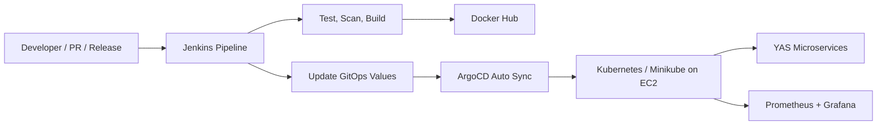

# YAS GitOps Platform

This repository contains the GitOps deployment configuration for the YAS microservices platform. It is designed as the deployment source of truth for ArgoCD and demonstrates a production-style CI/CD workflow where Jenkins builds and publishes container images, then promotes changes by updating Git instead of applying manifests directly to the cluster.

The goal of this project is to showcase a practical DevOps workflow for a microservices application:

```text
Developer / Pull Request / Release
  -> Jenkins CI/CD
  -> tests, security scans, Docker image build
  -> Docker Hub
  -> GitOps values update
  -> ArgoCD automated sync
  -> Kubernetes preview or staging environment
  -> Prometheus and Grafana observability
```

## Highlights

- GitOps-first deployment model with ArgoCD as the only controller applying YAS application changes to Kubernetes.
- Environment-specific Helm values for preview and staging.
- Split ArgoCD Applications by service group to reduce sync blast radius and make troubleshooting easier.
- Jenkins-compatible image promotion workflow for preview deployments, cleanup, and staging releases.
- Traceable image tagging strategy using branch/commit tags for preview and semantic release tags for staging.
- Metrics-ready staging configuration with ServiceMonitor support for Prometheus and Grafana.
- Git-based rollback model using `git revert` instead of manual cluster mutation.

## Architecture



Jenkins does not deploy YAS workloads with `kubectl apply` or direct Helm commands. Its deployment responsibility ends at building images, pushing them to Docker Hub, and committing image tag changes to this GitOps repository. ArgoCD watches the repository and reconciles the desired state into Kubernetes.

## Repository Layout

```text
gitops/
  argocd/
    applications/
      yas-preview-core.yaml
      yas-preview-apps.yaml
      yas-preview-ui.yaml
      yas-staging-core.yaml
      yas-staging-apps.yaml
      yas-staging-ui.yaml
    values/
      preview/
        <service>.yaml
      staging/
        <service>.yaml
  charts/
    <helm-chart-per-service>/
  README.md
```

The `charts/` directory is intentionally stored inside this repository. This keeps the GitOps repository self-contained, so ArgoCD can clone and render the deployment state without depending on relative paths from the application source repository.

## Environments

| Environment | Namespace | Purpose | Image tag strategy |
| --- | --- | --- | --- |
| Preview | `yas-preview` | Validate branch-specific service changes | `latest` as baseline, then `<branch>-<short-commit>` |
| Staging | `yas-staging` | Release candidate environment | Versioned release tags such as `v1.1` or `v1.2.3` |

Preview is optimized for developer validation. Jenkins updates the selected service image tag in `argocd/values/preview/`.

Staging is optimized for release validation. Jenkins updates one service group or all groups in `argocd/values/staging/` using a release version.

## ArgoCD Application Groups

The platform is split into multiple ArgoCD Applications per environment:

| Application | Namespace | Services |
| --- | --- | --- |
| `yas-preview-core` | `yas-preview` | `yas-configuration`, `product`, `customer`, `inventory` |
| `yas-preview-apps` | `yas-preview` | `cart`, `order`, `location`, `media`, `promotion`, `rating`, `recommendation`, `sampledata` |
| `yas-preview-ui` | `yas-preview` | `backoffice-bff`, `storefront-bff`, `backoffice-ui`, `storefront-ui`, `swagger-ui` |
| `yas-staging-core` | `yas-staging` | `yas-configuration`, `product`, `customer`, `inventory` |
| `yas-staging-apps` | `yas-staging` | `cart`, `order`, `location`, `media`, `promotion`, `rating`, `recommendation`, `sampledata` |
| `yas-staging-ui` | `yas-staging` | `backoffice-bff`, `storefront-bff`, `backoffice-ui`, `storefront-ui`, `swagger-ui` |

Some heavier or optional services, such as search and payment-related services, have chart or values files in the repository but are not part of the current active preview/staging Application groups. This keeps the demo environment realistic while staying within limited EC2/minikube resources.

## CI/CD Integration

This GitOps repository is updated by Jenkins pipelines from the YAS source repository.

### Pull Request CI

The PR validation pipeline in the source repository performs:

- Changed-module detection for the monorepo.
- Secret scanning with Gitleaks.
- Filesystem vulnerability scanning with Trivy.
- Java test and coverage execution.
- Frontend lint and build.
- SonarCloud analysis.

### Preview Deploy

The preview deployment pipeline builds one selected service and promotes it to `yas-preview`.

Input parameters:

```text
SERVICE_NAME
BRANCH_NAME
PREVIEW_NAMESPACE
BASE_IMAGE_TAG
```

Workflow:

```text
Build selected service
  -> tag image as <branch>-<short-commit>
  -> push image to Docker Hub
  -> update argocd/values/preview/<service>.yaml
  -> commit and push GitOps change
  -> ArgoCD auto-syncs yas-preview
```

Example image tag:

```text
dev-cart-a1b2c3d
```

### Preview Cleanup

The cleanup pipeline resets a preview service back to the stable baseline tag, currently `latest`.

Workflow:

```text
Set service image tag back to baseline
  -> commit and push GitOps change
  -> ArgoCD auto-syncs preview back to the baseline image
```

### Staging Release

The staging release pipeline promotes a versioned release to `yas-staging`.

Input parameters:

```text
RELEASE_VERSION
RELEASE_GROUP = core / apps / ui / all
SOURCE_REF
RUN_TESTS
```

Workflow:

```text
Build selected release group
  -> tag images with RELEASE_VERSION
  -> push images to Docker Hub
  -> update argocd/values/staging/<service>.yaml
  -> commit and push GitOps change
  -> ArgoCD auto-syncs yas-staging
```

Accepted release tag examples:

```text
v1.0
v1.0.10
v1.0.10-rc1
```

Staging should use explicit release tags rather than `latest`.

## Updating Image Tags

ArgoCD tracks Git state, not Docker Hub events. After Jenkins builds and pushes an image, it must commit the new image tag to this repository.

Backend or BFF service example:

```bash
yq -i '.backend.image.tag = "dev-cart-a1b2c3d"' argocd/values/preview/cart.yaml

git add argocd/values/preview/cart.yaml
git commit -m "Deploy preview cart image dev-cart-a1b2c3d"
git push
```

UI service example:

```bash
yq -i '.ui.image.tag = "v1.1"' argocd/values/staging/storefront-ui.yaml

git add argocd/values/staging/storefront-ui.yaml
git commit -m "Deploy staging storefront-ui v1.1"
git push
```

## Bootstrap ArgoCD Applications

After ArgoCD is installed in the `argocd` namespace, apply the Application manifests:

```bash
kubectl apply -f argocd/applications/yas-preview-core.yaml
kubectl apply -f argocd/applications/yas-preview-apps.yaml
kubectl apply -f argocd/applications/yas-preview-ui.yaml

kubectl apply -f argocd/applications/yas-staging-core.yaml
kubectl apply -f argocd/applications/yas-staging-apps.yaml
kubectl apply -f argocd/applications/yas-staging-ui.yaml
```

Check ArgoCD Applications:

```bash
kubectl get applications -n argocd
```

Check Kubernetes workloads:

```bash
kubectl get pods -n yas-preview
kubectl get svc -n yas-preview
kubectl get ingress -n yas-preview

kubectl get pods -n yas-staging
kubectl get svc -n yas-staging
kubectl get ingress -n yas-staging
```

## Local Access

The demo uses local hostnames routed through an ingress tunnel.

Preview hosts:

```text
storefront-preview.yas.local.com
backoffice-preview.yas.local.com
api-preview.yas.local.com
```

Staging hosts:

```text
storefront-staging.yas.local.com
backoffice-staging.yas.local.com
api-staging.yas.local.com
```

For local testing, map these hostnames to `127.0.0.1` in the Windows hosts file, then forward the ingress controller from the remote EC2/minikube cluster.

Preview tunnel:

```powershell
ssh -i <path-to-private-key> -L 8088:localhost:8088 ubuntu@<ec2-public-ip> "kubectl -n ingress-nginx port-forward --address 127.0.0.1 svc/ingress-nginx-controller 8088:80"
```

Staging tunnel:

```powershell
ssh -i <path-to-private-key> -L 8089:localhost:8089 ubuntu@<ec2-public-ip> "kubectl -n ingress-nginx port-forward --address 127.0.0.1 svc/ingress-nginx-controller 8089:80"
```

Example staging URLs:

```text
http://storefront-staging.yas.local.com:8089
http://backoffice-staging.yas.local.com:8089
http://api-staging.yas.local.com:8089
```

## Observability

Staging services are configured for metrics-based observability with Prometheus and Grafana. The main backend and BFF services enable `serviceMonitor.enabled: true` in staging values so they can be discovered by the Prometheus Operator.

Useful PromQL queries:

```promql
up{namespace="yas-staging"}
```

```promql
kube_deployment_status_replicas_available{namespace="yas-staging"}
```

```promql
sum(kube_pod_container_status_restarts_total{namespace="yas-staging"}) by (pod)
```

```promql
sum(rate(container_cpu_usage_seconds_total{namespace="yas-staging", container!="", image!=""}[5m])) by (pod)
```

```promql
sum(container_memory_working_set_bytes{namespace="yas-staging", container!="", image!=""}) by (pod)
```

If Spring Boot actuator metrics are exposed:

```promql
sum(rate(http_server_requests_seconds_count{namespace="yas-staging"}[5m])) by (application)
```

```promql
sum(rate(http_server_requests_seconds_count{namespace="yas-staging", status=~"5.."}[5m])) by (application)
```

## Rollback

Rollback is handled through Git history. Revert the GitOps commit that changed the image tag, then push the revert commit:

```bash
git log --oneline
git revert <commit-to-rollback>
git push
```

ArgoCD detects the desired-state change and syncs the cluster back to the previous image tag.

## Operational Notes

- Application workloads are managed by ArgoCD through this repository.
- Shared infrastructure, including PostgreSQL, Kafka, Elasticsearch, Keycloak, Redis, ingress-nginx, and observability tooling, is provisioned separately from the application GitOps flow.
- UI services use internal Kubernetes BFF service URLs for SSR communication:
  - `storefront-ui`: `http://storefront-bff/api`
  - `backoffice-ui`: `http://backoffice-bff/api`
- If Keycloak login redirects fail, add the preview and staging URLs to the Keycloak client redirect URI configuration.
- If a Git push is rejected because the remote has new commits, use `git pull --rebase origin main`, resolve conflicts, and push again.
- When resolving values conflicts, keep the newest intended image tag and preserve `serviceMonitor.enabled: true` for monitored staging services.

## Security Notes

Do not commit real credentials or machine-specific secrets to this repository:

- Docker Hub passwords or access tokens.
- GitHub tokens.
- ArgoCD tokens.
- kubeconfig files.
- SSH private keys.
- Real admin passwords.

This repository should contain declarative deployment configuration only. Runtime credentials should be managed through Kubernetes Secrets, external secret management, or environment-specific secure provisioning.

## Skills Demonstrated

- Jenkins CI/CD pipeline design for a microservices monorepo.
- Docker image promotion and traceable release tagging.
- Helm-based Kubernetes deployment management.
- ArgoCD multi-source Applications and automated synchronization.
- GitOps rollback and environment promotion strategy.
- Kubernetes operations for preview and staging environments.
- Prometheus/Grafana observability integration using ServiceMonitor.
- Practical separation of CI responsibilities from CD reconciliation.
